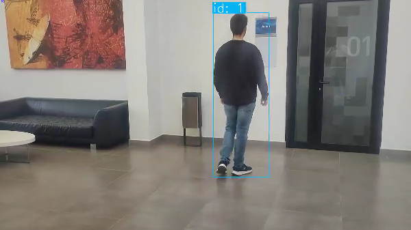
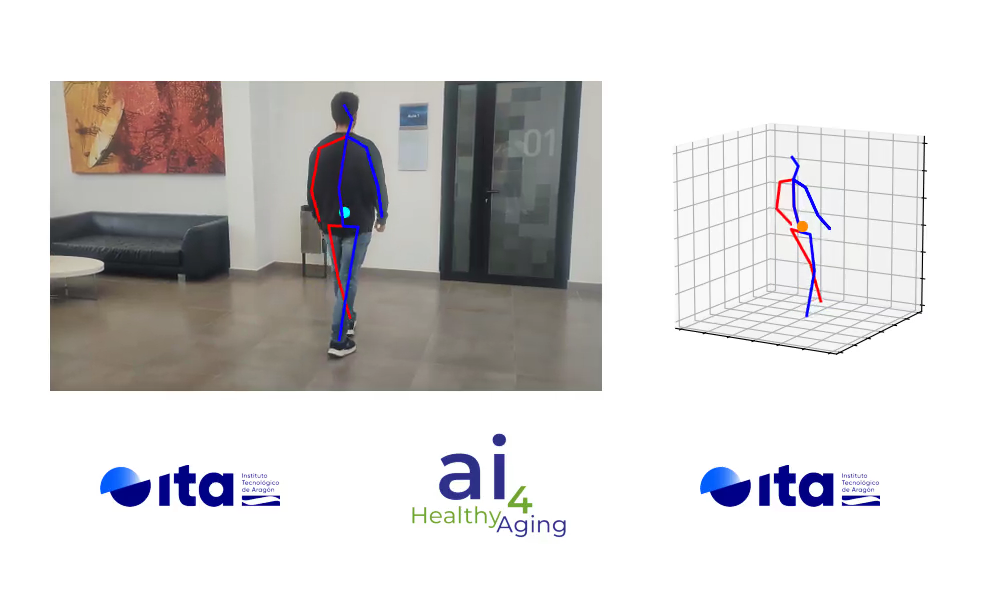

# BodyFlow

 


BodyFlow is a comprehensive library that leverages cutting-edge deep learning and other AI techniques, including new algorithms developed by the AI group at ITA, to accurately estimate human pose in 2D and 3D from videos. With its state-of-the-art algorithms, BodyFlow can detect events such as falls and walking, and in the future, the aim is to further expand its capabilities by developing classifiers for certain neurodegenerative diseases. The use of deep learning and advanced AI methods, combined with the innovative algorithms developed by the ITA AI group, makes BodyFlow a highly sophisticated and effective tool for analyzing human motion and detecting important events.

## Module 1: Human Pose Estimation (Multi-person and tracking)
The first module of this library contains three 2d detectors (MediaPipe2D, CPN, Lightweight) and six 3d detectors (Videopose3D, MHFormer, MixSTE, MotionBert, MediaPipe3D, ExPose) for predicting Human Pose from a set of monocular RGB images in a video sequence. The code from the original works has been refactored in a way that makes them easy to manipulate and combine since the methods used in this project are those that use 2d lifting, this is, first, a 2d pose estimator is used and then it is lifted with another algorithm to the final 3d pose. It is possible to add new 2d and 3d pose estimation algorithms if needed.

We also support multi-person pose estimation by tracking the different people in the frame. We include three different tracking algorithms (Sort, DeepSort, ByteTrack).

### Notes
It also admits end-to-end models (given a frame predict the 3d pose, like ExPose and MediaPipe3D). However, if the 2D pose is not detected then it will not predict the 3d pose. This is to preserve the working of the lifting 3d models that need a 2d keypoints buffer. To avoid that, you must use the Dummy2D detector, which always returns the 3d pose.

Then, be careful because bounding boxes only appear when 2d keypoints have been detected. This may lead to confusion because you may see few bounding boxes in the scene, but that means that 2d keypoints have been detected.

##  Module 2: Human Activity Recognition
The second module of the library classifies the activity held in the input. This module allows the user to train or test on custom data. 

BodyFlow includes models for activity recognition trained with [UP-FALL dataset](https://sites.google.com/up.edu.mx/har-up/). If data is available, the user may choose which type of features and which of the three pretrained models. It is possible to choose between 5 different types of features:

1. Only 2d pose.  `'2d'` -> 68 features
2. Only 3d pose. `'3d'` -> 102 features
3. Only IMUs. `'imus'` -> 30 features
4. 2d + 3d + IMUs. `'all'` -> 68 features
5. Only one IMU. `'ankle'` -> 6 features


There are three HAR models to choose from:
1. An LSTM based HAR model
2. A CNN-based HAR model 
3. A Transformer based HAR model


The HAR module implements two open-source libraries to facilitate the training and management of models: Pytorch Lightning and MLflow. 
- PyTorch Lightning is a popular open-source framework that is designed to make it easier to train machine learning
models with PyTorch. It provides a high-level interface for PyTorch that simplifies the process of training and evaluating deep learning models. 

- On the other hand, MLflow is an open-source platform for managing the end-to-end machine learning lifecycle. MLflow, which also supports integration with Pytorch, helps simplify and accelerate the machine learning development process by providing a unified platform for managing experiments, models, and deployments.


## Installation
The code has been tested with **Python 3.10**. Other Python versions may work, but they have not been tested.

We start by creating a conda environment with the following command:

`$ conda create -n bodyflow-env python=3.10.11`

`$ conda activate bodyflow-env`

Then, you should install the needed libraries (dependencies) which are defined in the requirements file. To do so, run the following command in the prompt:

`$ pip install -r src/main/python/requirements.txt`

If everything correct, pytorch, torchvision and torchaudio should be sucessfully installed. Cuda is needed to run some models. If there is any problem please check the `Problems & Solutions` section in this readme. Then you should install ffmpeg by running the following command:

`$ conda install ffmpeg`

It is also needed to install EGL devices for the ExPose module (see below). To do so, run the following command in the prompt:

`$ sudo apt-get install libegl1-mesa-dev libgles2-mesa-dev`

### Downloading the models

All the model weights files have been wrapped and may be downloaded by executing the following command:

`$ python src/main/python/human_pose_estimation/model_downloader.py`

*Note: If you have permission issues, you might need to execute the above line with `sudo`.*

### Problems & Solutions

1. If there is an error raised by mediapipe, the following command can solve it `$ pip install --upgrade protobuf==3.20.0`.
2. If an error is raised by load_weights, please downgrade PyTorch to the version described in the installation.
3. MLflow fails if there is another mlflow session running. To solve this, find the id of the mlflow process with the following command, kill it, and rerun mlfow ui. 

`$ ps -ax | grep "gunicorn" `
`$ mlflow ui`

4. The installation of **PyTorch** library is needed. This repository has been tested with cuda-enabled pytorch version 1.12.0 and torchvision 0.13.0 installed via conda (see below). Please refer to the official website [Pytorch Webpage](https://pytorch.org/) to obtain the correct PyTorch version according to your CUDA version. You may know the CUDA version by running `nvcc --version` in the prompt. 

`$ conda install pytorch torchvision torchaudio pytorch-cuda=11.7 -c pytorch -c nvidia`

*Note: The command `nvidia-smi` also provides the CUDA version, and it can be different from the previous command, so this might be the real CUDA version.*

Sometimes it appears some error related with the `chardet` package. In that case you install it `$ pip install chardet`. *Note that this package has GNU License*.


## UPFALL Dataset

For multimodal input, please refer to the *[UPFALL_synchronization instructions](src/main/python/synchronization/Synchronization_UPFALL_instruccions.md)*.

## Running the code

For the HPE (Human Pose Estimation) module, the main script to run the code is located in `src/main/python/human_pose_estimation/inference_server.py`.
To run the code, it is needed to select a 2d and 3d pose estimation predictor and the input data type.
Available 2d predictors are:
1. Mediapipe - (*Included*)
2. Cascade Pyramid Network (CPN) - (*Included*)
3. Lightweight - (*Included*)

Available 3d predictors are:
1. MHFormer - (*Included*)
2. Mediapipe - (*Included*)
3. MotionBert - (*[Installation instructions](src/main/python/human_pose_estimation/models/predictors_3d/motionbert/MotionBert_installation.md)*)
4. VideoPose3D - (*[Installation instructions](src/main/python/human_pose_estimation/models/predictors_3d/videopose/VideoPose3D_installation.md)*)
5. MixSTE - (*[Installation instructions](src/main/python/human_pose_estimation/models/predictors_3d/mixste/MixSTE_installation.md)*)
6. ExPose - (*[Installation instructions](src/main/python/human_pose_estimation/models/predictors_3d/expose_lib/ExPose_installation.md)*)


They are indicated in the following form:

`$ python src/main/python/human_pose_estimation/inference_server.py --predictor_2d {mediapipe2d, cpn, lightweight} --predictor_3d {mhformer, videopose, motionbert, mixste, mediapipe3d, expose}`

For example, to run CPN and MHFormer:

`$ python src/main/python/human_pose_estimation/inference_server.py --predictor_2d cpn --predictor_3d mhformer`

You can solo indicate the max_age of the tracker with the parameter `--max_age`.

The input type can be a .mp4 video, an orderer set of images in format .png, or video captured directly with the webcam. In the following examples we show how to run the code with each input type with CPN and MHformer combination.

On the other hand, for the HAR module, training or test may be used as follows:

`$ python src/main/python/human_activity_recognition/train.py --har_model cnn`

`$ python src/main/python/human_activity_recognition/test.py --har_model cnn`

### Video .mp4
The video must be accessible and the route has to be indicated as follows:

`$ python src/main/python/human_pose_estimation/inference_server.py --predictor_2d cpn --predictor_3d mhformer --input video --path path/to/video.mp4`

### Images .png
The folder must contain the images as follows 000001.png, 000002.png, 000003.png, etc. Then, the folder has to be passed as an argument as follows:

`$ python src/main/python/human_pose_estimation/inference_server.py --predictor_2d cpn --predictor_3d mhformer --input pictures --path path/to/pictures`

### Webcam
You have to know the camera number device that will use opencv to access it. If you do not know and do not have any other device connected to the laptop, then run the following code:

`$ python src/main/python/human_pose_estimation/inference_server.py --predictor_2d cpn --predictor_3d mhformer --input cam --video_source 0`

## For the Human Activity Recognition module

Please refer to *[HAR module instructions](src/main/python/human_activity_recognition/HAR_instructions.md)*

## Output
The output is a .csv which contains the 2d and 3d landmarks per each frame and the activity predictions. It is located in the folder `logs`. Additionally, if you input a video or a sequence of images, it is eligible for visualizing the pose. 

If there is clearly one single person in the video, we **highly recommend** setting `--tracking single`. On the other hand, if there is more than one person in the video you can choose your suitable tracker, however, we only allow displaying one single pose at a time, so the procedure would be setting `--bboxes_viz True` to render a video with the identified bounding boxes. Then you should identify the id of the bounding box of your interest and then select the id to plot the pose with `--viz [id]` where the id is the id of the bounding box. If no id is specified, by default it is 1. Both videos are stored at the root of the project. An example frame looks as follows:



An example of the pose estimation for the person with id 1 looks as follows:



To see the interface of MLflow you need to run `$ mlflow ui`.

#### ExPose additional outputs

The ExPose module extends its functionality by generating additional data types such as point clouds, meshes, and videos. These outputs are organized into specific directories: `data/exposeFraming` for point clouds and meshes, and `data/exposeVisualizer` for videos.

## Repositories 

These repositories are used to extend our code. We appreciate the developers sharing the codes.


- [Lightweight](https://github.com/Daniil-Osokin/lightweight-human-pose-estimation.pytorch)
- [Deep High-Resolution Representation Learning for Human Pose Estimation](https://github.com/leoxiaobin/deep-high-resolution-net.pytorch)
- [MHFormer](https://github.com/Vegetebird/MHFormer)
- [VideoPose3d](https://github.com/facebookresearch/VideoPose3D)
- [MixSTE](https://github.com/JinluZhang1126/MixSTE)
- [MotionBERT](https://github.com/Walter0807/MotionBERT)
- [ExPose](https://github.com/vchoutas/expose)

## Copyright
```
# --------------------------------------------------------------------------------
# BodyFlow
# Version: 2.0
# Copyright (c) 2024 Instituto Tecnologico de Aragon (www.ita.es) (Spain)
# Date: March 2024
# Authors: Ana Caren Hernandez Ruiz                      ahernandez@ita.es
#          Angel Gimeno Valero                              agimeno@ita.es
#          Carlos Maranes Nueno                            cmaranes@ita.es
#          Irene Lopez Bosque                                ilopez@ita.es
#          Jose Ignacio Calvo Callejo                       jicalvo@ita.es
#          Maria de la Vega Rodrigalvarez Chamarro   vrodrigalvarez@ita.es
#          Pilar Salvo Ibanez                                psalvo@ita.es
#          Rafael del Hoyo Alonso                          rdelhoyo@ita.es
#          Rocio Aznar Gimeno                                raznar@ita.es
#          Pablo Perez Lazaro                               plazaro@ita.es
#          Marcos Marina Castello                           mmarina@ita.es
# All rights reserved 
# --------------------------------------------------------------------------------
```

## License

Please refer to the LICENSE in this folder.

## Acknowledgement

BodyFlow was funded by project MIA.2021.M02.0007 of NextGenerationEU program and the Integration and Development of Big Data and Electrical Systems (IODIDE) group of the Aragon Goverment program.

# Versions detail

BodyFlow version 2.0 - Included HPE and HAR modules
BodyFlow Version 2.0 - Included Multi-person HPE module with tracking and HAR module.