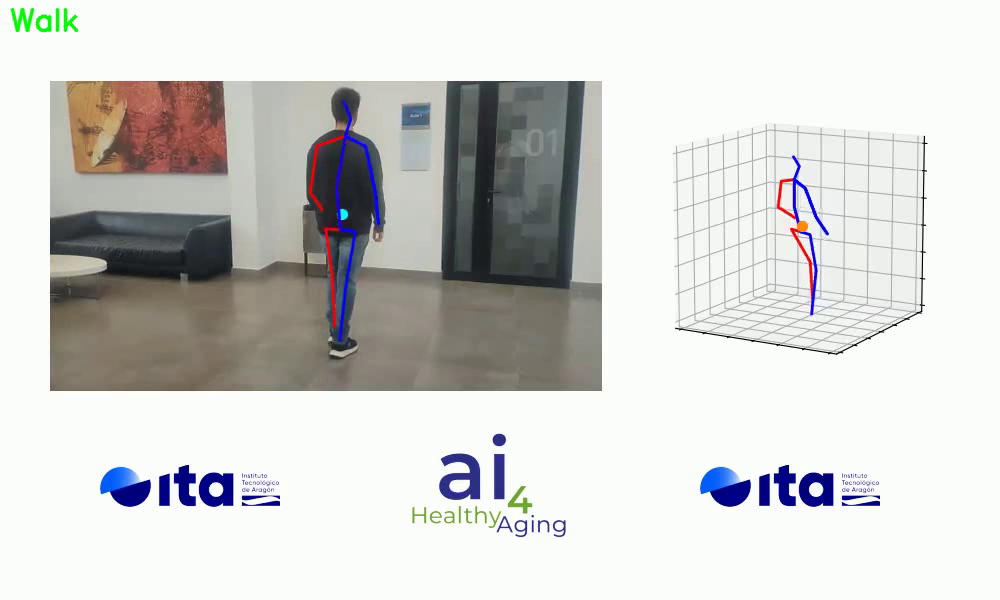

# Human Activity Recognition (HAR) Module Instructions

The HAR module is designed for human activity recognition using pretrained or custom models. It relies on pose data from the human_pose_estimation module, not sensor data. To use this module, you must first have access to the UPFALL dataset. Refer to the [UPFALL_synchronization instructions](../synchronization/Synchronization_UPFALL_instruccions.md) for details on syncing the dataset. Preprocessed data is also available [here](https://argon-docker.itainnova.es/repository/war/bodyflow/HAR/dataset/processed_harup.csv).

Download `processed_harup.csv` and place it at `/data/har/processed_harup.csv`. You may need to create this directory manually.

### Pretrained Models

We provide pretrained models that predict activities from pose estimation data (HPE). These models can be downloaded [here](https://argon-docker.itainnova.es/repository/war/bodyflow/HAR/models/HAR_models.zip). Once downloaded, copy the models to the following path:

```
src/main/python/human_activity_recognition
                        └───weights
                              | cnn_2d.pth
                              | cnn_3d.pth
                              | cnn_all.pth
                              | lstm_2d.pth
                              | lstm_3d.pth
                              | lstm_all.pth
                              | transformer_2d.pth
                              | transformer_3d.pth
                              | transformer_all.pth
```

## Running the Code

### Training

To train or test a model, navigate to the project’s root directory and execute `main.py` with the desired arguments:

```bash
$ python src/human_activity_recognition/main.py [ARGUMENTS]
```

Recommended arguments are as follows:

- `--har_model`: Choose from lstm, cnn, transformer (default: transformer).
- `--input_data`: Select the input data format (options: all, 2d, 3d, IMUs, ankle; default: 3d).
- `--batch`: Specify the batch size (default: 64).
- `--epochs`: Number of epochs to train (default: 100).
- `--path_dataset`: Path to the dataset (default: `data/har/processed_harup.csv`).
- `--label`: Choose between 'activity' or 'tag' labels (default: activity).
- `--window_step`: The step size of the window (default: 1).
- `--workers`: Number of worker threads for data loading (default: 64).
- `--gpu`: Choose the GPU device (0, 1, 2, 3; default: 0).
- `--dataset`: Specify the dataset to use (options: harup, harup_vision, itainnova; default: harup_vision).
- `--train`: Enable training mode (default: True).
- `--test`: Enable testing mode (default: False).
- `--tune`: Activate hyperparameter tuning (default: False).

### Inference

The inference pipeline uses pose data to predict activities in videos. The parameters and usage from `human_pose_estimation_inference.py` are as follows:

1. **Locate the Pose Estimation Log File**  
   Identify the `.log` file generated by the human_pose_estimation module.

2. **Run the Inference Script (Optional)**  
   With the log file ready, run the following command:

   ```bash
   $ python src/main/python/human_activity_recognition/human_pose_estimation_inference.py --path_dataset LOG_PATH
   ```

#### Inference Parameters:

- `--har_model`: Choose the model for HAR (options: lstm, cnn, transformer; default: lstm).
- `--input_data`: Type of input data used by the model (options: all, 2d, 3d; default: all).
- `--batch`: Batch size for loading data (default: 64).
- `--path_dataset`: Path to the log file generated by the human_pose_estimation module (default: `logs/Log_cpn_mhformer_person_walking.csv`).
- `--window_step`: Step size of the window (default: 1).
- `--window_size`: The size of the window (options: 21, 41, 81; default: 41).
- `--workers`: Number of worker threads for data loading (default: 64).
- `--gpu`: CUDA device to use (options: 0, 1, 2, 3; default: 0).
- `--render_video`: Path to the input video file if you wish to overlay predicted activities on the video (default: None).
- `--viz`: The ID of the bounding box (person) whose activities will be displayed in the video (default: 0).

3. **Output**  
   After running the script, the predicted activities will be saved in `dataset_har.csv`.

4. **Overlay Predictions on Video** (Optional)  
   If you want to overlay predictions on the video:

   ```bash
   $ python src/main/python/human_activity_recognition/human_pose_estimation_inference.py --path_dataset LOG_PATH --render_video VIDEO_PATH --viz BOUNDING_BOX_ID
   ```

   The output video will have activities displayed and will be saved as `.har_video.mp4`.

   

---

## Model Selection Guide

The Human Activity Recognition (HAR) module processes visual data (2D and 3D pose data, or both) to predict activities. When selecting a model, it’s crucial to balance performance and hardware requirements. Below are some considerations for selecting the appropriate model:

- **Hardware Considerations**:  
  If you're running inference on limited or low-power hardware (e.g., edge devices or mobile platforms), choosing a lightweight model is essential. While the LSTM model provides the best performance in terms of F1 score and accuracy, it also requires more computational resources. CNN and Transformer models might offer a more lightweight solution with slightly lower performance, making them suitable for less powerful hardware setups.

- **Performance**:  
  If your system can handle higher computational demands, LSTM is the best choice based on experimental results, particularly for visual data using all input features (2D and 3D). The LSTM model excels at handling temporal dependencies in sequential data, which makes it ideal for HAR tasks that involve pose estimation over time.

- **Input Data**:  
  This module only works with **visual data**, either in **2D**, **3D**, or both (referred to as "all"). If your setup involves both types of visual data, the "all" input configuration will yield the most comprehensive results. However, if your setup is constrained to 2D or 3D, you can choose those specific configurations.

### Summary of Recommendations:

- **LSTM**:  
  - **Best for**: Systems with ample computational resources.
  - **Performance**: Highest F1 score and accuracy.
  - **Input Options**: Works with 2D, 3D, or all (both 2D and 3D).
  - **Ideal use case**: When accuracy is the top priority and hardware resources are sufficient.

- **CNN or Transformer**:  
  - **Best for**: Systems with limited computational resources.
  - **Performance**: Slightly lower performance compared to LSTM but more efficient.
  - **Input Options**: Suitable for 2D or 3D data.
  - **Ideal use case**: When computational efficiency is prioritized over slight performance loss.

In summary, for the best accuracy, use **LSTM** with **all** input data if your hardware supports it. For more resource-constrained environments, consider **CNN** or **Transformer** models with 2D or 3D input data.
